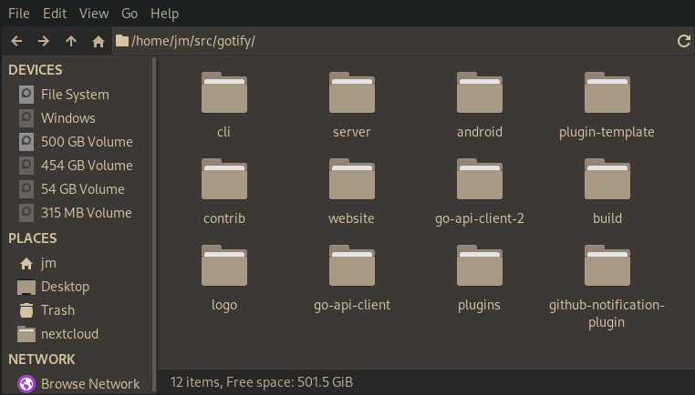
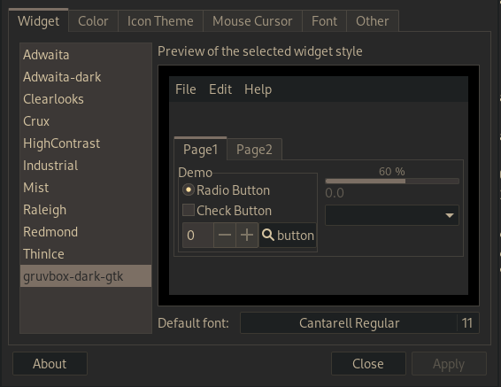
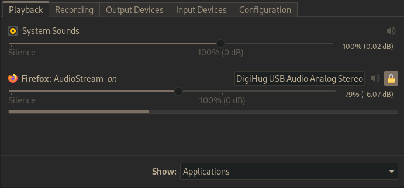

# jmattheis/gruvbox-dark-gtk

Created with https://github.com/themix-project/oomox

Used with https://github.com/jmattheis/gruvbox-dark-icons-gtk

### Manual

```bash
$ git clone https://github.com/ryuu22/gruvbox-dark-gtk-ryuu ~/.themes/gruvbox-dark-gtk-ryuu
```
Switch theme. (Can be done with lxappearance).

## Screenshots






